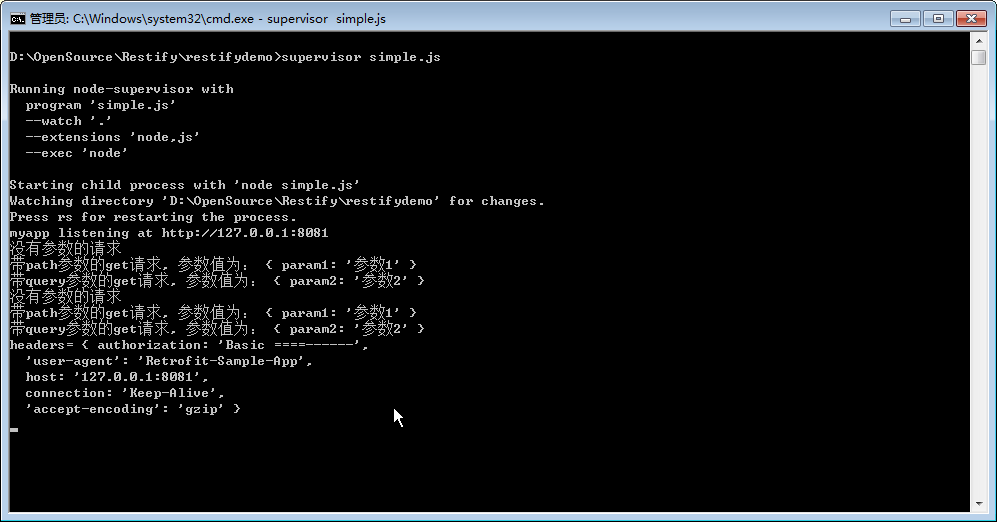
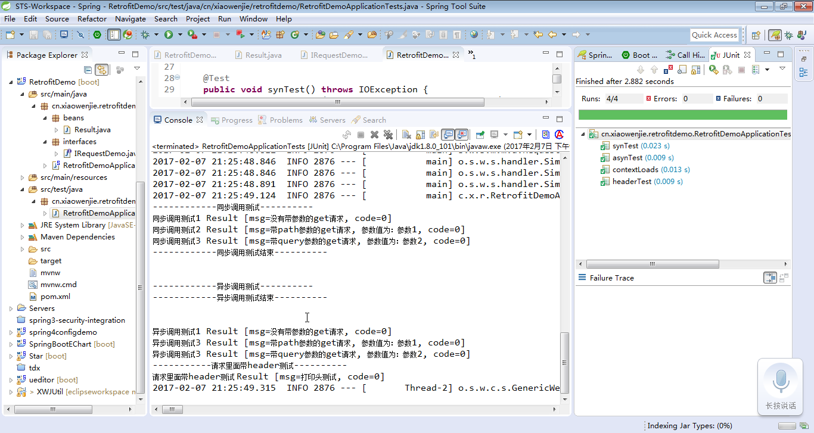

# RetrofitDemo - 2017.2.7
Retrofit基于springboot的调用例子。Retrofit是一个java和android端的http接口调用框架。详细请参考 http://square.github.io/retrofit/
例子里面测试3个简单的请求，并测试自定义header的请求。


## Nodejs开发的服务端

使用nodejs + restify组件 开发服务器

```

var restify = require('restify');

var ip_addr = '127.0.0.1';
var port    =  '8081';

var server = restify.createServer({
    name : "myapp"
});

server.use(restify.queryParser());
server.use(restify.bodyParser());
//server.use(restify.CORS());

var PATH = '/demo'
server.get({path : PATH + '/get1', version : '0.0.1'} , get1);
server.get({path : PATH + '/get2/:param1' , version : '0.0.1'} , get2);
server.get({path : PATH + '/get3' , version : '0.0.1'} , get3);

server.get({path : PATH + '/headtest' , version : '0.0.1'} , headtest);


// listen
server.listen(port ,ip_addr, function(){
    console.log('%s listening at %s ', server.name , server.url);
});

function get1(req, res , next){
    console.log('没有参数的请求');

    var result = { msg: '没有带参数的get请求', code: 0};
    res.send(200 , result);

    return next();
}

function get2(req, res , next){
    console.log('带path参数的get请求, 参数值为：', req.params);
    
    var result = { msg: '带path参数的get请求, 参数值为：' + req.params.param1, code: 0};
    res.send(200 , result);
    
    return next();
}

function get3(req, res , next){
    console.log('带query参数的get请求, 参数值为：', req.params);

    var result = { msg: '带query参数的get请求, 参数值为：' + req.params.param2, code: 0};
    res.send(200 , result);
    
    return next();
}

function headtest(req, res , next){
    console.log('headers=', req.headers);
    
    var result = { msg: '打印头测试', code: 0};
    res.send(200 , result);
    
    return next();
}


```

## 使用springboot开发的java客户端

增加依赖

```
<dependency>
  <groupId>com.squareup.retrofit2</groupId>
  <artifactId>retrofit</artifactId>
  <version>2.1.0</version>
</dependency>

<dependency>
    <groupId>com.squareup.retrofit2</groupId>
    <artifactId>converter-gson</artifactId>
    <version>2.1.0</version>
</dependency>
```

创建返回的结果类的bean

```
package cn.xiaowenjie.retrofitdemo.beans;

public class Result {

    private String msg;

    private int code;

    public int getCode() {
        return code;
    }

    public void setCode(int code) {
        this.code = code;
    }

    public String getMsg() {
        return msg;
    }

    public void setMsg(String msg) {
        this.msg = msg;
    }

    @Override
    public String toString() {
        return "Result [msg=" + msg + ", code=" + code + "]";
    }

}

```

创建请求的接口类

```

package cn.xiaowenjie.retrofitdemo.interfaces;

import cn.xiaowenjie.retrofitdemo.beans.Result;
import retrofit2.Call;
import retrofit2.http.GET;
import retrofit2.http.Headers;
import retrofit2.http.Path;
import retrofit2.http.Query;

public interface IRequestDemo {

    @GET("get1")
    Call<Result> get1();

    @GET("get2/{param1}")
    Call<Result> get2(@Path("param1") String str);

    @GET("get3")
    Call<Result> get3(@Query("param2") String str);

    @Headers({ "Authorization: Basic ====------",
        "User-Agent: Retrofit-Sample-App" })
    @GET("headtest")
    Call<Result> headtest();
}


```

springboot中增加处理接口的bean，需要指定json转换器。

```

package cn.xiaowenjie.retrofitdemo;

import org.springframework.boot.SpringApplication;
import org.springframework.boot.autoconfigure.SpringBootApplication;
import org.springframework.context.annotation.Bean;

import cn.xiaowenjie.retrofitdemo.interfaces.IRequestDemo;
import retrofit2.Retrofit;
import retrofit2.converter.gson.GsonConverterFactory;

@SpringBootApplication
public class RetrofitDemoApplication {

    public static void main(String[] args) {
        SpringApplication.run(RetrofitDemoApplication.class, args);
    }

    @Bean
    public IRequestDemo getIRequestDemo() {
        System.out.println("RetrofitDemoApplication.getIRequestDemo()");
        
        Retrofit retrofit = new Retrofit.Builder().baseUrl("http://127.0.0.1:8081/demo/")
                .addConverterFactory(GsonConverterFactory.create()).build();
        
        IRequestDemo service = retrofit.create(IRequestDemo.class);
        
        return service;
    }
}


```

创建测试的junit类

```

package cn.xiaowenjie.retrofitdemo;

import java.io.IOException;

import org.junit.Test;
import org.junit.runner.RunWith;
import org.springframework.beans.factory.annotation.Autowired;
import org.springframework.boot.test.context.SpringBootTest;
import org.springframework.test.context.junit4.SpringRunner;

import cn.xiaowenjie.retrofitdemo.beans.Result;
import cn.xiaowenjie.retrofitdemo.interfaces.IRequestDemo;
import retrofit2.Call;
import retrofit2.Callback;
import retrofit2.Response;

@RunWith(SpringRunner.class)
@SpringBootTest
public class RetrofitDemoApplicationTests {

    @Autowired
    IRequestDemo demo;

    @Test
    public void contextLoads() {
    }

    @Test
    public void synTest() throws IOException {
        System.out.println("------------同步调用测试----------");

        Call<Result> result1 = demo.get1();
        System.out.println("同步调用测试1 " + result1.execute().body());

        Call<Result> result2 = demo.get2("参数1");
        System.out.println("同步调用测试2 " + result2.execute().body());

        Call<Result> result3 = demo.get3("参数2");
        System.out.println("同步调用测试3 " + result3.execute().body());

        System.out.println("------------同步调用测试结束----------\n\n");
    }

    @Test
    public void asynTest() throws IOException {
        System.out.println("------------异步调用测试----------");

        Call<Result> result1 = demo.get1();
        result1.enqueue(new Callback<Result>() {

            @Override
            public void onResponse(Call<Result> call, Response<Result> response) {
                System.out.println("异步调用测试1 " + response.body());
            }

            @Override
            public void onFailure(Call<Result> call, Throwable e) {
                System.err.println(e.toString());
            }
        });

        Call<Result> result2 = demo.get2("参数1");
        result2.enqueue(new Callback<Result>() {

            @Override
            public void onResponse(Call<Result> call, Response<Result> response) {
                System.out.println("异步调用测试3 " + response.body());
            }

            @Override
            public void onFailure(Call<Result> call, Throwable e) {
                System.err.println(e.toString());
            }
        });

        Call<Result> result3 = demo.get3("参数2");
        result3.enqueue(new Callback<Result>() {

            @Override
            public void onResponse(Call<Result> call, Response<Result> response) {
                System.out.println("异步调用测试3 " + response.body());
            }

            @Override
            public void onFailure(Call<Result> call, Throwable e) {
                System.err.println(e.toString());
            }
        });

        System.out.println("------------异步调用测试结束----------\n\n");
    }

    @Test
    public void headerTest() throws IOException {
        System.out.println("-----------请求里面带header测试----------");

        Call<Result> result1 = demo.headtest();
        System.out.println("请求里面带header测试 " + result1.execute().body());
    }
}

```

先用node运行服务端：
node simple.js (推荐 supervisor simple.js)

然后在eclipse里面run junit test

## 结果
服务器：

客户端：

